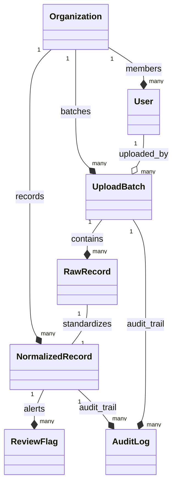

# Data Model Design (MODEL.md)

This document describes the database design for the ESG Data Ingestion and Analyst Review Platform. The architecture is built using Django REST Framework and is designed for scalability, data integrity, auditability, and multi-tenancy.

---

## 1. Schema Diagram & Relationships

Our database uses a multi-layered structure to separate raw ingested data from validated, audit-ready data:



---

## 2. Model Breakdown

### A. Multi-Tenancy Layer
Multi-tenancy is enforced at the database level by separating data using a Tenant identifier.
*   **`Organization`**: Acts as the tenant account. Every client company is isolated inside its own Organization partition.
*   **`User`**: Linked to an `Organization`. Users are assigned roles (e.g. `ADMIN`, `ANALYST`) that dictate authorization rules (Role-Based Access Control).

### B. Ingestion Layer (Source-of-Truth Tracking)
To satisfy the audit requirements, we preserve the original raw file data unmodified.
*   **`UploadBatch`**: Tracks each unique file upload session. It records the file's local/S3 path, the `source_type` (`SAP`, `UTILITY`, `TRAVEL`), the processing `status` (`PROCESSING`, `COMPLETED`, `FAILED`), and the uploading user.
*   **`RawRecord`**: Contains the exact row data from the uploaded CSV/Excel file in a `JSONField` (`payload`). This acts as the raw ledger, keeping the original column headers, text, and formatting for audit reconciliation.

### C. Normalization & Validation Layer
This holds standard, structured ESG records that are ready for emissions reporting.
*   **`NormalizedRecord`**: Contains standardized data fields:
    *   `scope`: Categorized as `SCOPE_1` (Direct), `SCOPE_2` (Indirect utilities), or `SCOPE_3` (Business travel).
    *   `activity_type`: Standardized activity name (e.g., "Diesel", "electricity").
    *   `consumption_value`: Float value.
    *   `unit`: Normalized unit (e.g., liters, kWh, km).
    *   `date`: Standardized date field.
    *   `review_status`: Review state (`PENDING`, `APPROVED`, `REJECTED`).
    *   `locked`: A boolean flag set to `True` upon approval, freezing the record from any future edits.
*   **`ReviewFlag`**: Stores warning flags generated by the rule-based validation engine. Flag types include `NEGATIVE_VALUE`, `OUTLIER`, `MISSING_DATA`, and `INVALID_DATE`. A record can have multiple unresolved or resolved flags.

### D. Audit Ledger Layer
Ensures compliance by keeping an immutable history of modifications.
*   **`AuditLog`**: Captures every system operation (`UPLOAD`, `APPROVE`, `REJECT`, `EDIT`, `RESOLVE_FLAG`). For edits, it stores a JSON diff comparing the modified payload fields from old to new values:
    ```json
    {
      "changes": {"consumption_value": 150.0},
      "previous": {"consumption_value": 0.0}
    }
    ```

---

## 3. Justifications for Key Design Decisions

1. **One-to-One Raw to Normalized Relationship**: Keeping a separate `RawRecord` and `NormalizedRecord` ensures that analysts can always inspect what was originally uploaded. If an auditor asks why a value is `125.5` but the normalized record says `150.0`, they can inspect the `RawRecord` to verify the original file input.
2. **Hard-Locking Approved Records**: Once an analyst approves a record, the `locked` field is set to `True`. The PUT endpoint explicitly rejects modifications to locked rows, ensuring compliance with audit standards where finalized reports must be tamper-proof.
3. **Database-Enforced Multi-Tenancy**: All APIs filter queries by `organization=request.user.organization` at the controller layer. This guarantees data isolation and prevents leaks between tenants.
